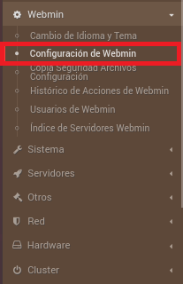

## Instalación y configuración de un servidor web.

Para instalar el servidor web vamos a trabajar con una máquina virtual desde Oracle VM VirtualBox. [Aquí](https://www.virtualbox.org/) encontrarás qué es VirtualBox, como descargarlo y como funciona. El sistema operativo que hemos elegido para instalarlo es Ubuntu 18.04 que encontrarás en el siguiente [enlace](http://cdimage.ubuntu.com/netboot/18.04/).

Para instalarlo vamos a utilizar la herramienta [Webmin](http://www.webmin.com/), que nos permite administrar el sistema desde un navegador. [Aquí](https://www.solvetic.com/tutoriales/article/5427-como-instalar-webmin-en-ubuntu-18-04/) una guía de como instalarlo.

Ahora que ya hemos preparado el entorno de trabajo, vamos a empezar a isntalar el servidor Apache.

1. El primer paso es acceder a **Webmin** y dentro de esa pestaña pinchamos en *Configuración de Webmin*
  

2. Nos aparecerá un menú con diferentes opciones, nosotros utilizaremos *Módulos de Webmin*.

3. Ahora tenemos que elegir desde donde queremos instalarlo. Por defecto está seleccionada la opción *Desde archivo local* pero nosotros utilizaremos el *Módulo estándar de www.webmin.com* y pulsando en el icono señalado en la imagen a continuación elegiremos el módulo Apache.

4. En la barra de buscador buscamos *Apache*, lo seleccionamos y clicamos en Select.

5. Ahora solo debemos clicar en Instalar módulo.

6. Una vez que le hemos dado nos aparece un proceso de descarga e instalación.

7. El último paso de la instalación es comprobar que realmente el servidor está funcionando. Para ello, escribiremos nuestra dirección IP seguida de dos puntos y 80 en la barra de direcciones. Por ejemplo: 10.0.2.15:80.

Si funciona correctamente, debería aparecer la página por defecto del servidor web Apache.

Ahora que ya tenemos nuestro servidor Apache instalado es necesario configurarlo. 
