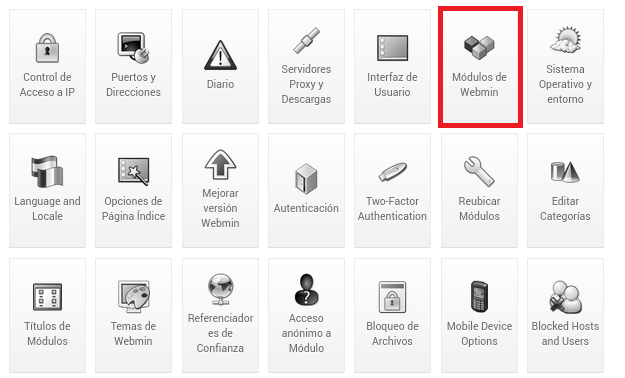
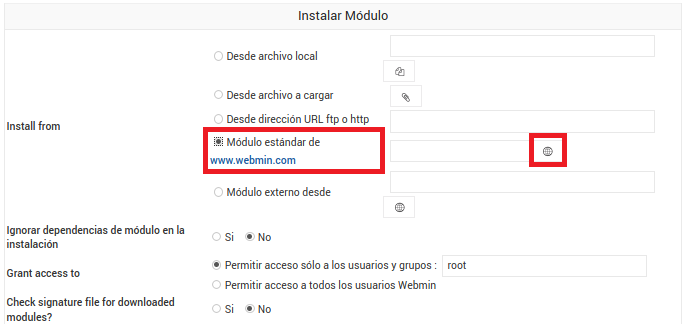
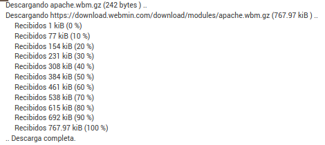
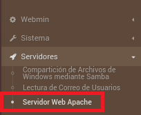
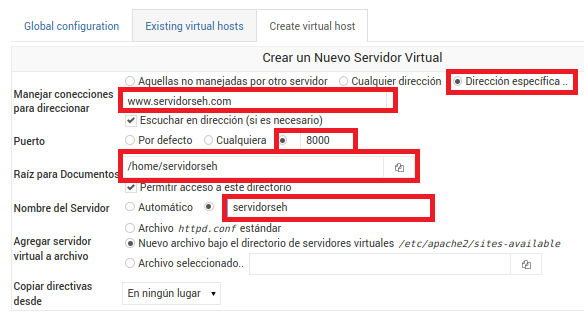

## Instalación y configuración de un servidor web.

Para instalar el servidor web vamos a trabajar con una máquina virtual desde Oracle VM VirtualBox. [Aquí](https://www.virtualbox.org/) encontrarás qué es VirtualBox, como descargarlo y como funciona. El sistema operativo que hemos elegido para instalarlo es Ubuntu 18.04 que encontrarás en el siguiente [enlace](http://cdimage.ubuntu.com/netboot/18.04/).

[Aquí](https://www.youtube.com/watch?v=VTGDqFZ81JY&list=PL9oB7UFHn_bQICy3WlzK6IwQMx4HBoe_Y&index=1) una guía de como instalar el sistema operativo en VirtualBox con las tarjetas de red necesarias para realizar la práctica. 

Para instalarlo vamos a utilizar la herramienta [Webmin](http://www.webmin.com/), que nos permite administrar el sistema desde un navegador. En este [enlace](https://www.youtube.com/watch?v=2143l30jiow&list=PL9oB7UFHn_bQICy3WlzK6IwQMx4HBoe_Y&index=2) encontrarás una guía de como instalar Webmin y aplicar la configuración de tarjetas de red.

Ahora que ya hemos preparado el entorno de trabajo, vamos a empezar a isntalar el servidor Apache.

1. El primer paso es acceder a **Webmin** y dentro de esa pestaña pinchamos en *Configuración de Webmin*
  

2. Nos aparecerá un menú con diferentes opciones, nosotros utilizaremos *Módulos de Webmin*.

3. Ahora tenemos que elegir desde donde queremos instalarlo. Por defecto está seleccionada la opción *Desde archivo local* pero nosotros utilizaremos el *Módulo estándar de www.webmin.com* y pulsando en el icono señalado en la imagen a continuación elegiremos el módulo Apache.

4. En la barra de buscador buscamos *Apache*, lo seleccionamos y clicamos en Select.

5. Ahora solo debemos clicar en Instalar módulo.

6. Una vez que le hemos dado nos aparece un proceso de descarga e instalación.

7. El último paso de la instalación es comprobar que realmente el servidor está funcionando. Para ello, escribiremos nuestra dirección IP seguida de dos puntos y 80 en la barra de direcciones. Por ejemplo: 10.0.2.15:80.

Si funciona correctamente, debería aparecer la página por defecto del servidor web Apache.

Ahora que ya tenemos nuestro servidor Apache instalado, vamos a crear un servidor web virtual. Pero para ello neccesitamos configurar un nombre DNS, [aquí](https://www.youtube.com/watch?v=zavT_BAir-4&list=PL9oB7UFHn_bQICy3WlzK6IwQMx4HBoe_Y&index=7/) tenemos una guía de como hacerlo.

1. Una vez que ya hemos creado el nombre DNS, desde **Servidores** accedemos al *Servidor Web Apche*.

2. Nos vamos al apartado de Create virtual host, en el que rellenaremos los campos seleccionados en la imagen. Para este paso deberás crear un directorio con el nombre del nombre DNS en el directorio raíz.

Recuerda que la dirección debe ser "www.servidorTUSINICIALES.com".

El puerto será el 8000 por que es el que utiliza Apache por defecto.

3
